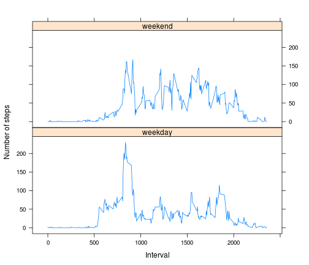

# Reproducible Research: Peer Assessment 1
==========================================

## Introduction

This document describes the proedure to accomplish the above mentioned assignment. It assumes that **Activity Monitoring Dataset** file *activity.csv* is in the same folder as this document.  

## Data Description

The dataset consists of number of steps measured during a 5-minute interval for the period of Oct-Nov 2012. Missing values are coded as **NA**. The dataset is a csv file with 17,568 observations.  


Following variables are included in the dataset:  

* **steps:** Number of steps in a 5-minute period.
* **date:** Measurement date in YYYY-MM-DD format.  
* **interval:** Identifying 5-minute interval for the measurement

## Assignment

This assignment is to use R markdown language using knitr package.  


## Loading various packages


```r
library(plyr)
library(lattice)
library(data.table)
```

```
## data.table 1.9.2  For help type: help("data.table")
```


## Loading and preprocessing the data


```r
df = read.csv("activity.csv", stringsAsFactor = F)
str(df)
```

```
## 'data.frame':	17568 obs. of  3 variables:
##  $ steps   : int  NA NA NA NA NA NA NA NA NA NA ...
##  $ date    : chr  "2012-10-01" "2012-10-01" "2012-10-01" "2012-10-01" ...
##  $ interval: int  0 5 10 15 20 25 30 35 40 45 ...
```


The *date* field is converted to date datatype.  

A new field  **period** is added with a format of **HHMM** using *interval* field.  


```r
df$date = as.Date(df$date, "%Y-%m-%d")
df$period = sprintf("%04d", df$interval)
```


## What is mean total number of steps taken per day?

To achieve the above measure, we first summarize the steps taken per day. Using this computed variable  histogram is plotted, mean and median steps per day are computed:  

### Histogram of average daily steps


```r
dfDaily = ddply(df, .(date), summarise, dailySteps = sum(steps, na.rm = T))
hist(dfDaily$dailySteps, breaks = 25, main = "Histogram of Daily Steps Taken", 
    xlab = "Number of steps", ylab = "Freguency")
```

 


### Mean and Median of daily steps


```r
avgStepsPerDay = round(mean(dfDaily$dailySteps))
medStepsPerDay = median(dfDaily$dailySteps)
```


The mean number of steps taken per day is **9354** and median number of steps taken each day is **10395**.  Since median value is more than the mean value, distribution of steps taken per day is positively skewed.


## What is the average daily activity pattern?

To compute average daily activity pattern, the data is summarized over *period* field. Average steps taken per period is calculated as summary.  

### Time series line plot of average daily activity pattern


```r
dfPeriod = ddply(df, .(period), summarise, periodSteps = round(mean(steps, na.rm = T)))
with(dfPeriod, {
    plot(period, periodSteps, type = "l", main = "Average steps taken during 5 minute periods of a day", 
        xlab = "5 minute period", ylab = "Number of steps")
})
```

 


### Interval having maximum steps

The following code determines in which period contains maximum steps averaged across all the days of the study period.  


```r
maxSteps = max(dfPeriod$periodSteps)
periodMaxSteps = with(dfPeriod, period[which(periodSteps == maxSteps)])
```


Period **0835** has the maximum number of **206** steps.  


## Imputing missing values

The input data set has a number of intervals with missing steps indicated by **NA**. We will impute these values with the average steps of the corresponding period, as calculated in Daily average activity pattern. This will be done using powerful intrinsics provided by data.table package.  

### Total number of rows with missing values


```r
nRowsWithNA = length(which(rowSums(is.na(df)) > 0))
```


There are **2304** rows in the dataset where **steps** field  has **NA** value. Please note that, this is not the number of days with miising values but number of intrevals with missing values.


### Imputing Missing Values Strategies & creating new dataset

We split the input data set into NOT NA and NA dataset. NA dataset is populated with the average steps of the corresponding interval. Finally both the data subsets are combined to get the imputed dataset.  


```r
dfPeriod$periodSteps = as.integer(dfPeriod$periodSteps)

## convert the datasets into data tables
t_df = data.table(df, key = "period")
t_period = data.table(dfPeriod, key = "period")

## split the input dataset into NA & non-NA subsets
t_not_na = t_df[which(rowSums(is.na(t_df)) == 0), ]
t_na = t_df[which(rowSums(is.na(t_df)) > 0), ]

## replace the NA values with average for the corresponding interval
t_na = t_na[t_period, `:=`(steps = i.periodSteps), nomatch = 0]

## combine the subsets to form a new dataset
new_df = data.frame(rbind(t_not_na, t_na))
```

### Histogram of total steps after imputation


```r
new_dfDaily = ddply(new_df, .(date), summarise, dailySteps = sum(steps, na.rm = T))
hist(new_dfDaily$dailySteps, breaks = 25, main = "Histogram of Daily Steps taken after imputing", 
    xlab = "Number of steps", ylab = "Freguency")
```

 

### Mean, Median & determination of impact after imputation


```r
new_avgStepsPerDay = round(mean(new_dfDaily$dailySteps))
new_medStepsPerDay = median(new_dfDaily$dailySteps)
```


The mean number of steps is **1.0766 &times; 10<sup>4</sup>** and new median value is **10762**. 

These values are different than the original values. The difference is because for the original dataset, we ignored the intervals with NA values, but in the new dataset we replaced these values with mean. This will make the total number of steps bigger than the original mean and median.


## Are there differences in activity patterns between weekdays and week

To identify the difference in activity pattern, we first classify the activity date as weekday or weekend. Once done, aggregation over the interval is done taking the day type in consideration.

### Weekend vs. Weekday classification


```r
new_df$dayType = "weekday"
new_df$dayType[weekdays(new_df$date, abbreviate = T) %in% c("Sat", "Sun")] = "weekend"
new_df$dayType = factor(new_df$dayType)
## doing the aggregation based on day type and interval
new_dfPeriod = ddply(new_df, .(dayType, interval), summarise, periodSteps = round(mean(steps, 
    na.rm = T)))
```


### Time series plot based on day type


```r
xyplot(periodSteps ~ interval | dayType, data = new_dfPeriod, type = "l", layout = c(1, 
    2), xlab = "Interval", ylab = "Number of steps")
```

 


As we can see from the chart, weekday steps are higher during the morning hours, possibly due to work out or running, where as daytime steps are more than that of weekday. This may be due to doing weekend chores while working during the weekday.  

